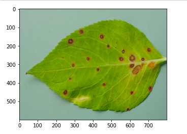
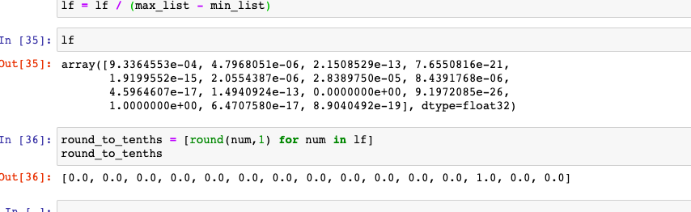

# Leaf_disease_detection

This project aims to detect the disease on a leaf into one of fifteen categories, using deep convolutional neural networks.

## MODEL USED
In neural networks, Convolutional neural network (ConvNets or CNNs) is one of the main categories to do images recognition, images classifications. Objects detections, recognition faces etc., are some of the areas where CNNs are widely used.

## WORKFLOW

1. READ DATASET
• The model is trained on the Kaggle dataset. This dataset consists of around 43,000+ , 256x256 sized leaf images with fifteen categories.

2. DATA PREPARATION
• The original dataset in Kaggle is available as Image files. I imported the dataset in Google colab and converted the images to Numpy arrays.

3. MODEL BUILDING
• The region of image containing the spots is passed as input to the CNN. The network outputs a list of scores. Whichever the position is the maximum output corresponds to one of the fifteen categories.

